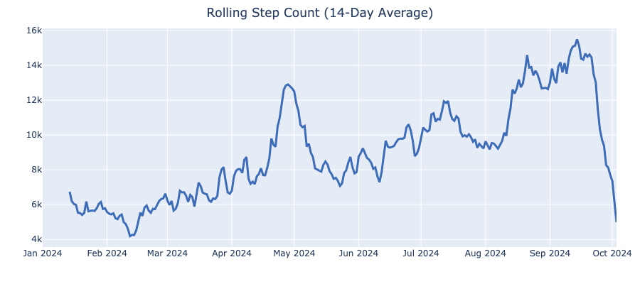
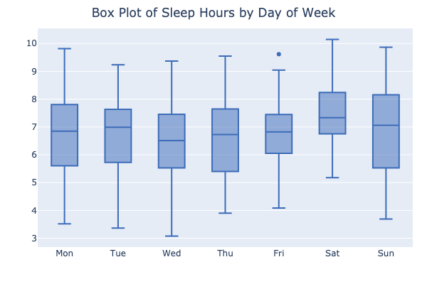
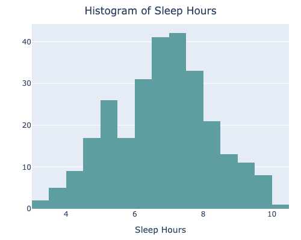

# Health and Workout Data Parser

This project is a comprehensive parser and cleaner for health and workout data, such as sleep, heart rate, VO2 Max, physical activities, and more. It processes Apple Health XML exports, parses the data into structured JSON format, and then cleans and organizes it for further analysis.

## Features

- **XML Unzipping:** Automatically extracts Apple Health export files from a `.zip` archive.
- **Data Parsing:** Parses various health, activity, workout, and sleep data using multiple parsers.
- **Data Cleaning:** Cleans and processes parsed data for consistent and accurate results.
- **Logging:** Uses `loguru` for logging all steps, including parsing, cleaning, and error handling.
- **Modular Structure:** Organized into categories like health, activity, sleep, and workout data.

## Project Structure


```
.
├── data/
│   ├── cleaned/                 # Clean data (CSV)
│   ├── processed/               # Processed data (XML -> JSON)
│   ├── raw/                     # Location for the "export.zip" file from the Apple Health Export.  
├── src/
│   ├── analysis/
│   │   ├── plots/               # Plotting functions
│   │   │   └── examples/        # Directory to save plot examples as PNGs
│   │   └── plot_utils.py        # Centralized functions to generate different plot types (line, box etc.) 
│   │   └── plots.py             # Example plots 
│   ├── constants/
│   │   └── activity.py          # Constants for activity data
│   │   └── health.py            # Constants for health data
│   │   └── paths.py             # Paths for data directories and files
│   │   └── sleep.py             # Constants for sleep data
│   │   └── workout.py           # Constants for workout data
│   ├── parsers/
│   │   ├── activity_parsers.py  # Parsers for activity data
│   │   ├── base_parser.py       # Base parser template
│   │   ├── health_parsers.py    # Parsers for health-related data
│   │   ├── sleep_parsers.py     # Parsers for sleep data
│   │   └── workout_parser.py    # Parser for workout data
│   ├── cleaners/
│   │   ├── activity_cleaner.py  # Cleaner for activity data
│   │   ├── health_cleaner.py    # Cleaner for health data
│   │   ├── sleep_cleaner.py     # Cleaner for sleep data
│   │   └── workout_cleaner.py   # Cleaner for workout data
│   ├── data_loading.py          # Handles unzipping the export file
│   ├── data_parsing.py          # Parses all data categories
│   ├── data_cleaning.py         # Cleans all data categories
│   └── utils.py                 # Utility functions (e.g., saving data to JSON)
├── README.md                    # Project documentation
└── requirements.txt             # Python dependencies
└── main.py                      # Main entry point
```

## Installation

1. Clone the repository:
    ```bash
    git clone https://github.com/jacobjacobjacobjacobjacob/apple-health-data-parser.git
    cd health-workout-data-parser
    ```

2. Install the required dependencies:
    ```bash
    pip install -r requirements.txt
    ```

3. Set up the required directories and paths. Update the `EXTRACTION_PATH`, `ZIP_FILE_PATH`, and other constants in the `constants/paths.py` file as per your setup.

## Usage
### 1. Export your Apple Health data
 Export your data from the "Health" app on your iPhone (Browse -> Profile -> Export All Health Data). 

 This will give you a folder called "apple_health_export", place this folder in data/raw/.

### 2. Unzipping the Apple Health Export
To unzip the `export.zip` file containing the Apple Health data:

```python
from src.data_loading import unzip_export

unzip_export()
```

### 3. Parsing Data
To parse all categories of data (health, sleep, activity, workout):

```python
from src.data_parsing import parse_all_data

parsed_data = parse_all_data()
```

This will parse the data into structured JSON files for each category and save them in the `PARSED_DATA_DIRECTORY`.

### 4. Cleaning Data
To clean the parsed data for further analysis:

```python
from src.data_cleaning import clean_all_data

clean_all_data()
```

This will clean and save the processed data into the `CLEANED_DATA_DIRECTORY`.

### 5. Analysing the data
Now that the data is cleaned and structured, you can analyse it further. For example, you can easily calculate the total values for each month in a specified year:
| Month | Energy Burned | Physical Effort | Step Count | Exercise Time | Flights Climbed | Workout Hours | Sleep Hours |
|-------|---------------|-----------------|------------|---------------|-----------------|---------------|-------------|
| Jan   | 59562         | 86308           | 306409     | 2213           | 434             | 28             | 202         |
| Feb   | 60580         | 69262           | 389641     | 3789           | 1809             | 38             | 196         |
| Mar   | 61602         | 31684           | 207076     | 836           | 399             | 6             | 220         |

You can apply filtering, and get the mean stats to display how much you slept each night, the average number of steps etc.
```python
monthly_mean[monthly_mean['Month'].isin(['Jun', 'Jul', 'Aug'])][
    ["Month", "Exercise Time", "Step Count", "Resting Heartrate", "VO2 Max", "Sleep Hours"]]
```
| Month | Exercise Time | Step Count | Resting Heartrate | VO2 Max | Sleep Hours |
|-------|---------------|------------|-------------------|---------|-------------|
| Jun   | 107.5         | 9400.3     | 52.7              | 47.2    | 6.7         |
| Jul   | 106.1         | 10378.4    | 55.9              | 49.2    | 7.3         |
| Aug   | 126.3         | 12569.1    | 50.4              | 50.7    | 6.5         |


#### 1. DataFrame Loader
The `DataFrameLoader` class allows you to load all CSV files from a specified directory into Pandas DataFrames, making the data preparation process more efficient.

```python
from src.analysis.load_dataframes import DataFrameLoader
loader = DataFrameLoader(CLEANED_DATA_DIRECTORY)
dataframes = loader.load_all_dataframes()
```

#### 2. DataFrame Merger
The `DataFrameMerger` class facilitates the merging of various health and workout data into a single DataFrame for comprehensive analysis.

```python
from src.analysis.merge_dataframes import DataFrameMerger
merger = DataFrameMerger(dataframes)
merged_df = merger.merge_dataframes()
```
#### 3. Plotting Functions
- **Histogram**: Create histograms with customizable bins, colors, and layout options.
- **Line Plot**: Generate line plots with support for rolling averages and custom styling.
- **Box Plot**: Display box plots for analyzing distributions, with flexible layout and color options.

Example usage:
```python
# Creating a histogram of resting heart rate
create_histogram(df, x_axis="Resting Heartrate", title="Resting Heartrate Distribution")

# Creating a rolling average line plot for step count
create_line_plot(
    df, x_axis="date", y_axis="Step Count", rolling_average=True, rolling_window_days=14
)

# Creating a box plot for sleep hours by day of the week
create_box_plot(df, x_axis="day_of_week", y_axis="Sleep Hours", title="Sleep Hours by Day")
```

#### 4. Plot Examples





## Log Output
This project uses `loguru` for logging all operations. Logs include details on the number of records parsed, errors, and processing times.

## Contributing

Contributions are welcome! Feel free to submit a pull request or file an issue with any bug reports, feature requests, or suggestions.

## License

This project is licensed under the MIT License - see the [LICENSE](LICENSE) file for details.
